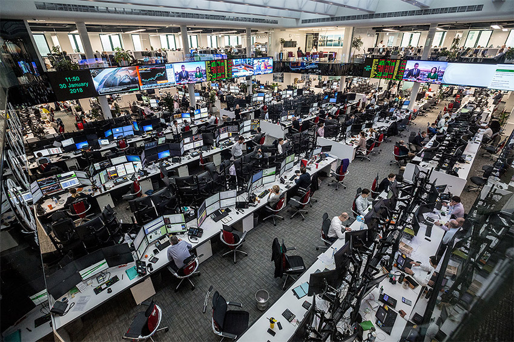

# Final course project

## Project background

The compound of technologies we use to call 'AI' promises to revolutionize many
sectors. However, there is a substantial gap between what firms say they do with
AI and what they actually do with it [1].  Several factors could account for
such a gap: the adoption of AI tools is costly since it tends to jeopardize an
incumbent's operations [2]; there is a shortage of human capital trained in the
area of AI [3]; developing AI applcations may require businesses to cope with
ethical/societal implications [4, 5] and regulatory issues [6]. In the context
of knowledge intensive industries, there is yet another obstacle to the
diffusion of AI, namely, 'professionals.' While some individuals may be
thrilled to integrate AI in their daily work, some others may just feel
threatened. This FCP deals with the distribution of security traders opinions
about the impact AI can make on 'trading floors.'

## Aim & context

You're a 'quant' business analyst working for a consultancy company that has to
help a client to sustain the diffusion of AI. Specifically, the client is a 
large investment bank that would like to persuade traders to engage more with
AI tools when it comes evaluating securities.

## Dataset

In order to get a better understanding of traders' attitudes toward AI, you have
circulated a survey in a large trading floor located in Canary Wharf. The
resulting dataset ([trading_floor.xml][dataset]) contains 192 responses
regarding:

- the undirected network of knowledge exchange between traders (traders A and B
  are connected when A says he/she shares technical and industry knowledge
  with B and _vice versa_)
- a trader's opinion about the contribution of AI to his/her productivity and 
  effectiveness in evaluating securities (1 = not at all; 10 = to a great 
  extent). In the datasets, this variable is reported as the node attribute `ai`.

Thanks to the cooperation of the client, you also know the traders' location
in the floor. There are six zones, each of which hosts 32 individuals (16 
individuals on each side of the zone). The above-displayed picture gives
you an idea of the layout of the trading floor. In the dataset, the location
of traders is reported as two node attributes, that is, `x-pos` and `y-pos`.

## Questions

1. How do traders' opinions map onto the knowledge exchange network?
2. How do traders' opinions map onto the physical layout of the trading floor?
3. What are the network-related obstacles to the diffusion of positive 
   opinions about AI in the trading floor?
4. What is your recommendation to promote the diffusion of positive opinions
   about AI in the trading floor?

## Deliverables

By Dec 17 (4:00 PM) you're supposed to upload onto Moodle a 800 word (max) 
document addressing questions 1 - 4 in plain English. The document must also
contain the Python code and results ― being tables and/or charts ― 
supporting your answers. Code, results, and references (if any) do not count 
against the 800-word limit. 

## References

[1] Lanzolla, Gianvito, Simone Santoni, and Christopher Tucci. ["Unlocking value from AI in financial services: strategic and organizational tradeoffs vs. media narratives."](https://www.elgaronline.com/view/edcoll/9781839104381/9781839104381.00014.xml) In Artificial Intelligence for Sustainable Value Creation. Edward Elgar Publishing, 2021.

[2] Agrawal, Ajay, Joshua Gans, and Avi Goldfarb. ["Prediction machines: the simple economics of artificial intelligence."](https://books.google.co.uk/books?hl=en&lr=&id=wJY4DwAAQBAJ&oi=fnd&pg=PT9&dq=prediction+machines&ots=51ehWs1ZXw&sig=qxjEvs6xapOqy-LNbQb9VIMAQ3E&redir_esc=y#v=onepage&q=prediction%20machines&f=false) Harvard Business Press, 2018.

[3] Ross, Jeanne. ["The fundamental flaw in AI implementation."](https://www.proquest.com/docview/1986317444?pq-origsite=gscholar&fromopenview=true) MIT Sloan Management Review 59, no. 2 (2018): 10-11.

[4] Hajian, Sara, Francesco Bonchi, and Carlos Castillo. ["Algorithmic bias: From discrimination discovery to fairness-aware data mining."](https://dl.acm.org/doi/abs/10.1145/2939672.2945386) In Proceedings of the 22nd ACM SIGKDD international conference on knowledge discovery and data mining, pp. 2125-2126. 2016.

[5] Akter, Shahriar, Grace McCarthy, Shahriar Sajib, Katina Michael, Yogesh K. Dwivedi, John D’Ambra, and K. N. Shen. ["Algorithmic bias in data-driven innovation in the age of AI."](https://www.sciencedirect.com/science/article/pii/S0268401221000803?casa_token=r6H7CVS1adQAAAAA:mB3uL8wTkxezcwjo2Fq_qZem8mC4aBdlAWf-RqZNX-hm9s6zMOsd31sPWLPBwFgFrp0l4FePqA) (2021): 102387.

[6] Abbott, Ryan. ["The reasonable robot: artificial intelligence and the law"](https://www.amazon.co.uk/Reasonable-Robot-Artificial-Intelligence-Law/dp/1108459021/ref=sr_1_12?keywords=regulation+artificial+intelligence&qid=1637628113&qsid=260-8183790-3047035&s=audible&sr=1-12&sres=1687081476%2C3030359778%2CB0933P1S1H%2C1108844936%2C1839109963%2C3030323609%2C1786439042%2C1800371713%2CB084F8SM4L%2C191268778X%2C1509950680%2C1108459021%2C0198870949%2C1509937064%2CB08WK51XXQ%2CB07RZW9K4R&srpt=ABIS_BOOK) Cambridge University Press, 2020.

[dataset]:  https://github.com/simoneSantoni/net-analysis-smm638/blob/9114bedfde4195f2e5ed4fa5c868e3d41b26f939/finalCourseProject/trading_floor.xml