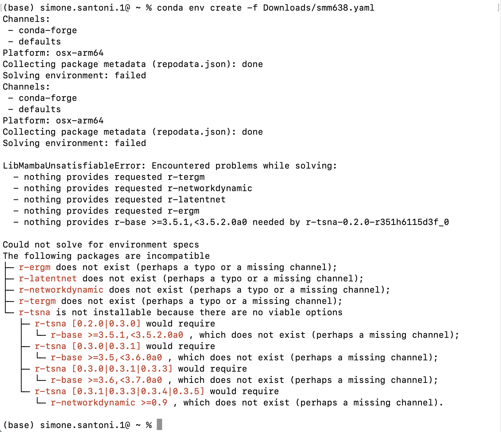
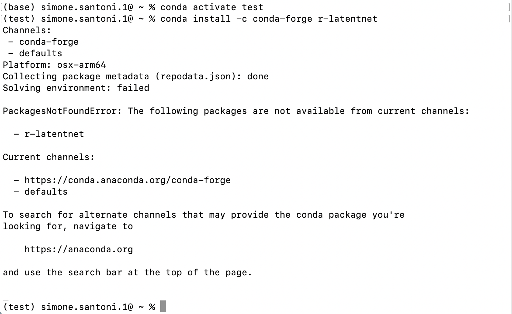
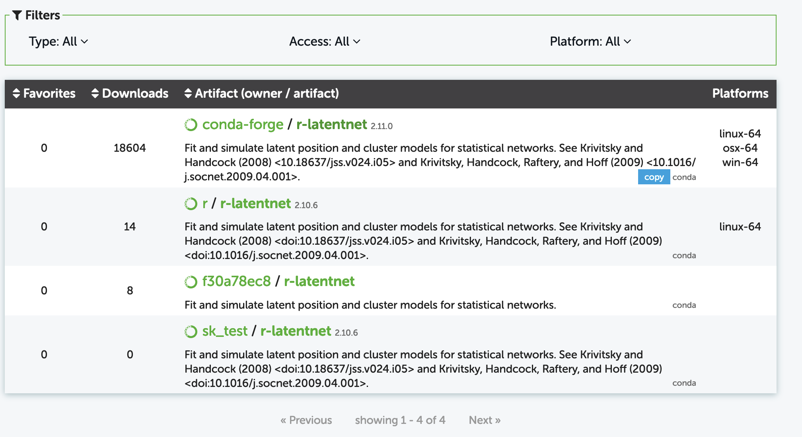

# Environment for SMM638

## Procedure 

To help you create a suitable environment for SMM638, I created the enclosed
configuration file containing a minimum selection of R and Python modules for
network analysis. You may want to make the environment by opening a terminal
emulator and running `conda env create -f smm638.yaml`. Ensure the file
`smm638.yaml` is in your current directory (i.e., the directory in which you
open your terminal emulator -- typically, your 'home' folder). Once you have
created the new environment, you can enact it by running `conda activate
smm638`. Note that a few R modules we will use -- namely, 'Siena', 'relevent',
and 'ergmgp' -- are unavailable via conda-forge. Those modules may be fetched
from alternative Anaconda channels or within an R session using
`install.packages("foo")`

## Troubleshooting

### Issue

In some instances, MacOS users cannot create the enviornment per
my message https://moodle4.city.ac.uk/mod/forum/discuss.php?d=26796. I could 
replicate the issue using a MacBook Pro 16" equipped M1 processor. Below 
is the screenshot of the error.

### Context

I investigate the issue, which seems illogical to me. For example, the module 
`r-latentnet` cannot be installed. The error message indicates that the 
module is not available in the selected channel. However, that is incorrect.
If you browse https://anaconda.org/search?q=r-latentnet, you can verify that 
the module is available for Win, Mac, and Linux.

### Proposed solution

1. Edit the .yaml file by removing the modules that -- for some reasons -- cannot 
be fetched now. I.e., r-ergm, r-latentnet, r-networkdynamic, r-tergm, r-tsna
2. Open a terminal emulator
3. Create the environment smm638 by running the edited .yaml file
4. Enact the newly created environment
5. Open a Radian or R shell in terminal emulator
6. Install the modules indicated in point 1 from CRAN. This must be done from 
   a Radian or R shell running against the environment smm638. In other words,
   **DO NOT INSTALL** these packages on your system installation of R

FYI, I will not change the .yaml file that I shared with you, which works 
for Windows and Linux users (and some Mac users too).