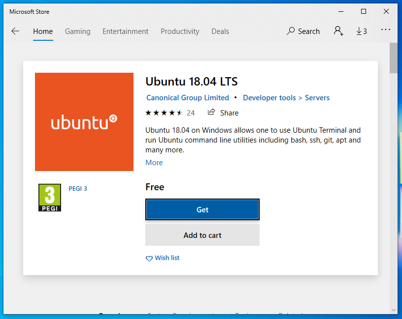
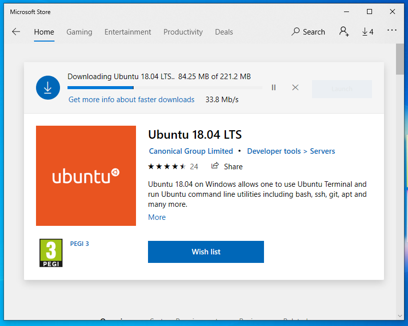
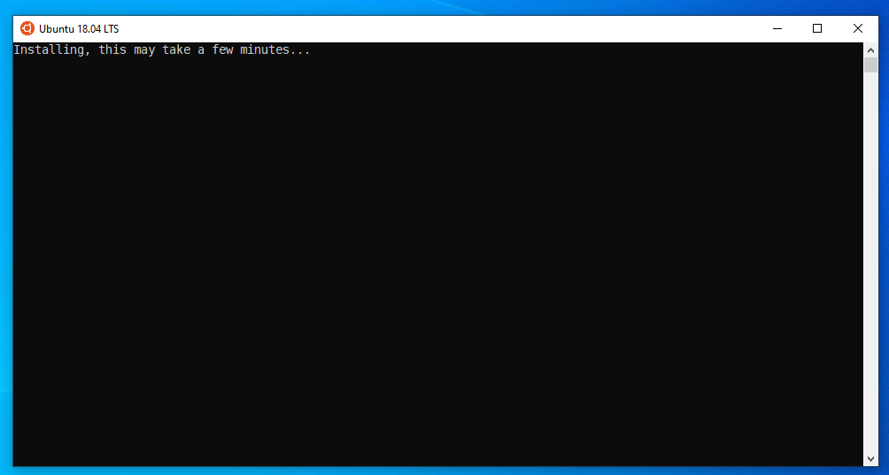
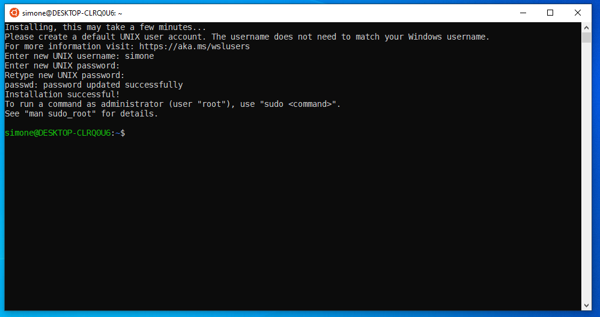
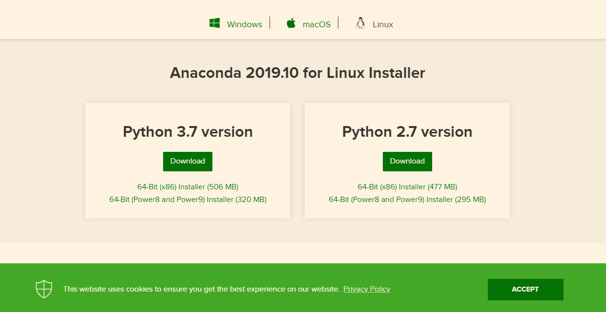

'Running' Linux Distros on Win10 - README
=========================================

This is a step-by-step guide to install a Linux distro (e.g., Ubuntu or Debian
) on
 Win10 machine.

Step 1
------

Launch the Microsoft Store app.

Step 2
------

Search for Ubuntu 18.04 (for example).

Step 3
------

Download Ubuntu 18.04

Step 4
------

From the 'Start' menu, launch Ubuntu 18.04. A new terminal will pop-up - the installer will run automatically.

Step 5
------

Pass your username and password, and that's it.

Step 6
------

At this point, you can install Anaconda in your Ubuntu 18.04 machine.

Download an image of Anaconda by copying and pasting the following onto the prompt in which Ubuntu is running:

    wget https://repo.anaconda.com/archive/Anaconda3-2019.10-Linux-x86_64.sh

Once the download is finished, you can install Anaconda by copying and pasting: 

    bash Anaconda3-2019.10-Linux-x86_64.sh

You will be guided through the process; the default options are just fine.

Step 7
------

In order to run a Jupyter server from within your Ubuntu 18.04 machine:

    jupyter notebook --no-browser

Open your browser and go to localhost:8888 (just make sure there's no other
 Jupyter server ongoing in your Win10 OS).

Step 8
------

Use `conda` from the Ubuntu prompt to manipulate your environments.

