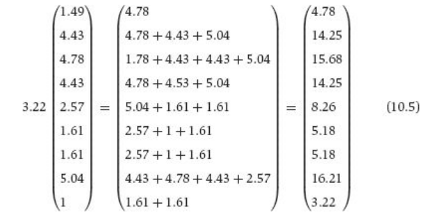

# Notes on the 'eigenvector centrality'

Here's a passage from Bonacich & Lu's book 'Introduction to Mathematical
Sociology':

     Eigenvector centrality is the refinement of degree centrality. As you
     remember, degree centrality is “blind” in the respect that it doesn’t
     take into account anything past immediate friends. In many networks the
     importance of a node is dependent on the importance of the nodes to which
     it is connected, not the sheer number. In a high school an individual who
     is the friend of one very high status person becomes popular because of
     that one connection. The current men’s basketball head coach at Oregon
     State University, Craig Robinson, enjoys a cache because he is President
     Obama’s brother-in-law. In a communications network a node is exposed to
     lots of information if her immediate neighbors possess lots of
     information because they themselves are well connected. ... The actual
     computation of eigenvector centrality is beyond the scope of this book,
     but the results are easy to illustrate. Consider, for example, the nine
     workers in the largest component of the bank wiring room, Figure 10.2.
     The centrality of each worker is proportional to the sum of the
     centralities of the actors to which he is connected. The measure is
     basically degree centrality, but it weighs each person’s friends by the
     amount of friends they have, and then the amount of friends the friends
     of their friends have, and so on.

Figure: Figure 10.2 from Bonacich and Lu's book

The details of the eigenvector centrality indicator are included in Bonacich's
seminal paper 'Bonacich, P. (1987). Power and centrality: A family of
measures. _American Journal of Sociology_, 92(5), 1170-1182.' Please get in
contact with the lecturer for further information or explanation about the
estimation procedure.
