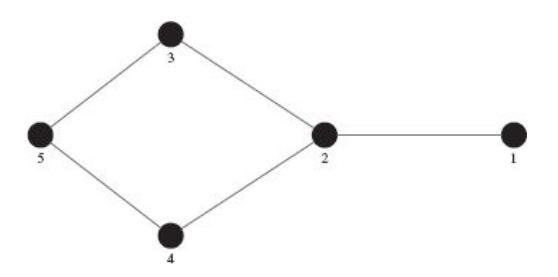
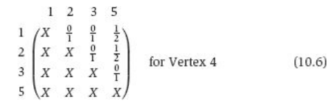
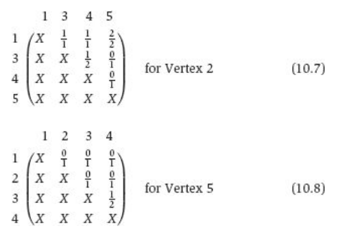

# Notes on 'betweeness centrality'

Here's a passage from Bonacich & Lu's book 'Introduction to Mathematical
Sociology':

    Remember that centrality refers to two different phenomena: the degree to
    which a node in a network is advantageously placed and the degree to which
    a node is important for the functioning of the network as a means for
    distributing resources, where edges are transmission routes. Betweenness
    centrality is the latter type of centrality score. Let’s go back to your
    large retail store. Instead of placing your price scanner in a nice spot,
    suppose you have a new product that you want to promote. If you used the
    criterion represented through closeness centrality, you would place this
    product in the center of the store. However, the center of your store is
    not necessarily the place with the highest traffic, it’s only the place
    that’s the closest if someone from any random location in your store
    suddenly decides to confirm that you are really trying to hawk them an old
    Rick Astley CD for $15. What a rip-off. If you wanted to promote a
    product, you would probably want to place it in a location where most
    people would eventually pass by it. Any location by the checkout scanners
    or the entrance of your store would fit this new criterion.

    In networks, betweenness centrality tries to find vertices that are in
    locations with high traffic. It represents a type of power that is
    distinct from the popularity of degree centrality or the influence of
    closeness centrality. For example, consider a network with three vertices:
    a factory, a wholesaler, and a retailer. The wholesaler’s entire
    profitability is based on his betweenness centrality. If there were a
    direct connection from the factory or retailer, and no need to go through
    the wholesaler, the wholesaler would go out of business. That’s the
    premise behind the marketing strategy of Costco, a wholesale retail store.
    Consumers believe they’re getting better prices because they are bypassing
    the retail end of the chain, and buying wholesale. A newspaper editor has
    a lot of power because she is the gatekeeper between reporters and
    readers. She can selectively choose which stories to run and which stories
    to leave out. In social networks, betweenness centrality represents those
    who are in positions that offer unique advantages in the transmission or
    flow of goods or ideas.

Figure: Figure 10.3 - Example network for betweeness centrality

    Like closeness centrality, betweenness centrality is based on geodesics,
    or shortest paths. It measures the degree to which communication (or other
    quantities) flows through different vertices when members use the network
    to communicate with one another indirectly. To calculate betweenness
    centrality for a node i in a component of size n go through the following
    steps:

           1. For each of the (n − 1) (n − 2)/2 pairs {j, k} of vertices that
    do not include i, calculate all the geodesics connecting j and k that
    include and exclude vertex i. Take the proportion of geodesics connecting
    j and k that flow through node i.

           2. Add up all these (n − 1) (n − 2)/2 proportions. This is the
           closeness centrality of vertex i. It’s range is from 0 to (n − 1)
           (n − 2)/2.

    To take a very simple example, look at the network in Figure 10.3. Let us
    first consider Vertex 4. The following labeled matrix shows the proportion
    of the geodesics between every pair of vertices that pass through Vertex
    4. For example, there is one geodesic between Vertices 3 and 4, and it
    does not pass through Vertex 4. Therefore the element in the row labeled 1
    and the column labeled 3 is 0/1 = 0. There are two geodesics between
    Vertices 1 and 5: 1-2-3-5 and 1-2-4-5. One of the two includes 4, so the
    element in the row labeled 1 and the column labeled 5 is 1/2.

    The sum of all the numbers in Equation 10.6 is 0+0+1/2+0+1/2+0 = 1, the
    betweenness centrality of Vertex 4. The entries in the matrix follow the
    ordering of vertex numbers, omitting the vertex for which the score is
    given. Equations 10.7 and 10.8 show the calculations for the betweenness
    centralities of Vertices 2 and 5.

  

    Adding up the values in the matrices for the different vertices, we find
    that the centrality scores for the five vertices is (0, 3 , 1, 1, ).
    Vertex 2 isby far the most central.

    Looking at the bank wiring room, Solderman 1 in Figure 10.1 is “between”
    all the four nodes to his right and all the four vertices to his left. His
    betweenness centrality score is therefore 16. At the other extreme,
    Inspector 1 and Solderman 3 are not on any geodesics. The removal of a
    node that is high on betweenness centrality would eliminate many geodesics
    and therefore would tend to increase the distances between other pairs of
    nodes in the network. The removal of a node with a score of zero would
    have no effect on distances between other pairs.
